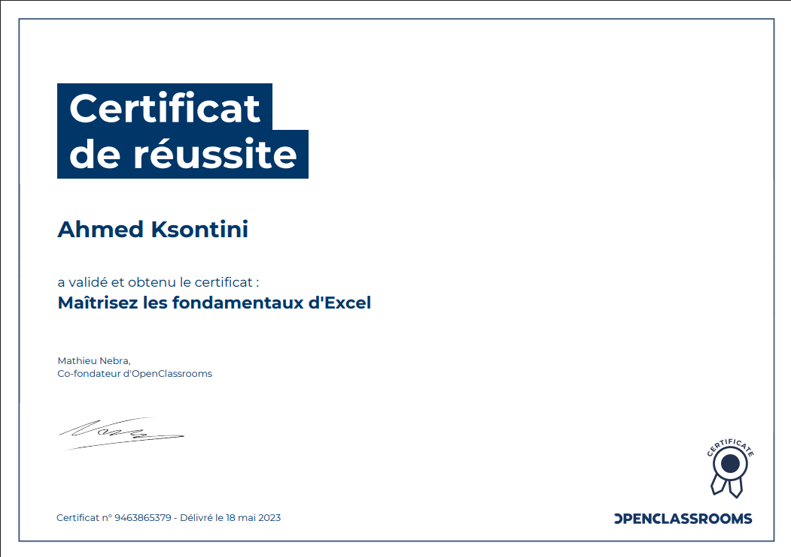
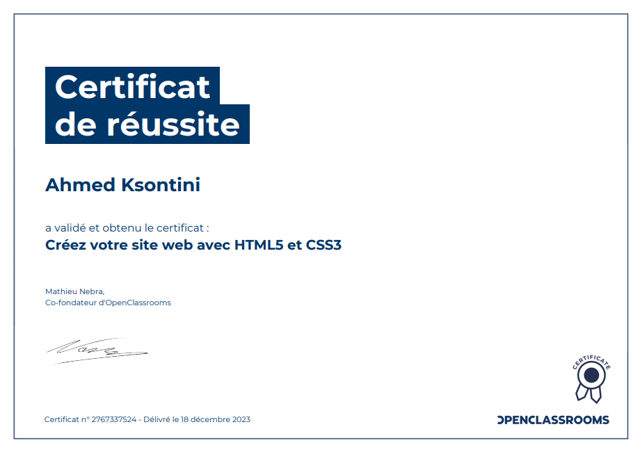

<h1 align="center">👋 Welcome to My GitHub Profile!</h1>

  

  
  
  
  

  <strong>I'm Ksontini Ahmed, a motivated and fast-growing software developer. Even though I’m new to the development world, I’ve already built several complete web and mobile projects on my own and gained real experience collaborating directly with clients. I’m highly driven, full of innovative ideas, and always ready to take on new challenges. I love teamwork, continuous learning, and exploring modern technologies to create impactful digital solutions.

---

## 🧑‍💻 About Me

- 🇹🇳 Full-Stack Software Developer  
- 💡 I love creating powerful mobile & web applications  
- 📚 Always learning and improving my skills  
- 🌐 Portfolio:  
  👉 **https://ahmedksontini-dev.github.io/portfolio**

---

## 🌟 Career Highlights

- 👨‍💻 **Freelance Developer**  
  Developed several web & mobile projects with excellent client feedback on quality, communication, and delivery.
  
- 💼 **Internship — Cube Solution**  
  Worked on web development, optimization, and digital solutions.

- 🛠 **Internship — Ministry of Education (Regional Delegation of Nabeul)**  
  IT maintenance, troubleshooting, and technical support.

- 💻 **Developer Intern — Hammamet Informatique Service**  
  Actively contributed to software development projects.

---

## 🚀 Tech Stack

  

---

## 🏆 My Projects

### 🔹 Web & Mobile Applications
- 🏠 **Real Estate Platform + Mobile App (Graduation Project)**  
- 🍽 **Meal Planning App**  
- 🎤 **Conference Management System**  
- 🤝 **Handball World Management** *(already hosted)*  
- 💎 **PERLINEA – Jewelry E-commerce Store**  
- 🤖 **IA Studio – AI Tools Platform**  
- 🚗 **Car Rental Contract Management System**  
- ✈️ **TuniTrip – Booking website (cars, excursions, transfers)**  

---

## 🎓 Education

- 🎒 High School Level  
- 🏫 **2 years — Applied IT for Management** – Institut Central des Cadres Supérieurs de Tunis  
- 🎓 **2 years — BTS** – Elite Formation Nabeul  

---

## 📜 Certifications

### • Software Developer Certification — College de Paris (June 13, 2025)

### • Intercampus Hackathon — Amilcar University (April 19, 2025)

### • Finance Law 2024 & RNE — (February 21, 2024)

### • Excel Fundamentals — OpenClassroom (May 18, 2023)

### • HTML & CSS — OpenClassroom (December 18, 2023)

### • Data Transfer Instructions — Mindluster (December 02, 2023)

<table>
  <tr>
    <td></td>
    <td></td>
    <td></td>
    <td></td>
    <td></td>
    <td></td>
  </tr>
  <tr>
    <td align="center">Software Developer Certification</td>
    <td align="center">Intercampus Hackathon</td>
    <td align="center">Finance Law 2024 & RNE</td>
    <td align="center">Excel Fundamentals</td>
    <td align="center">HTML & CSS</td>
    <td align="center">Data Transfer Instructions</td>
  </tr>
</table>

---

## 🖥 My Setup

- 🖥 **Gigabyte**  
- ⚡ Intel Core **i7 13th Gen**  
- 🧠 **64GB RAM**  
- 🎮 **RTX 4060**  

---

## 🌍 Languages

- 🇫🇷 French  
- 🇹🇳 Arabic  
- 🇬🇧 English  

---

## 🔗 Social & Contact

  
  &nbsp;&nbsp;
  

---

## ❤️ Thanks for Visiting!

  

